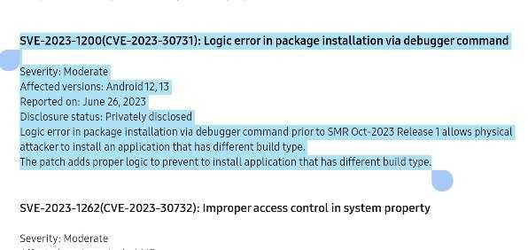
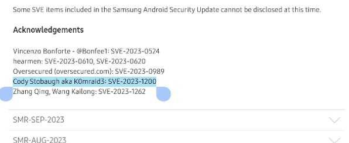
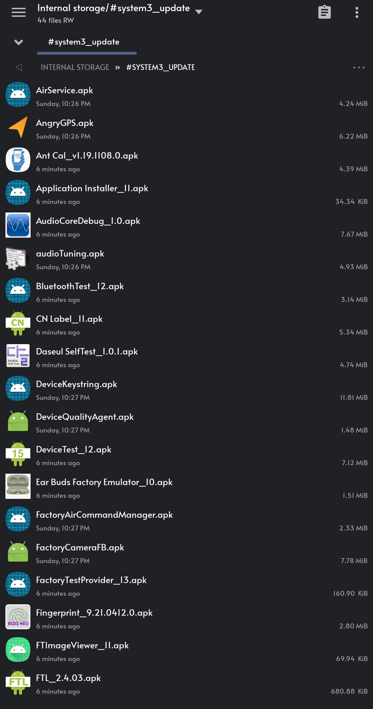
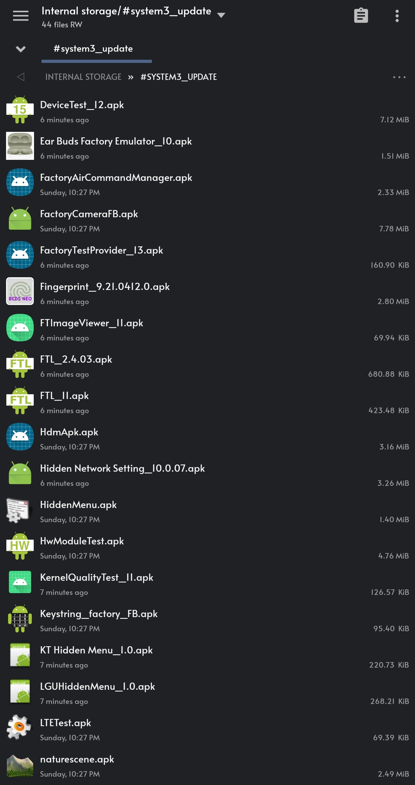
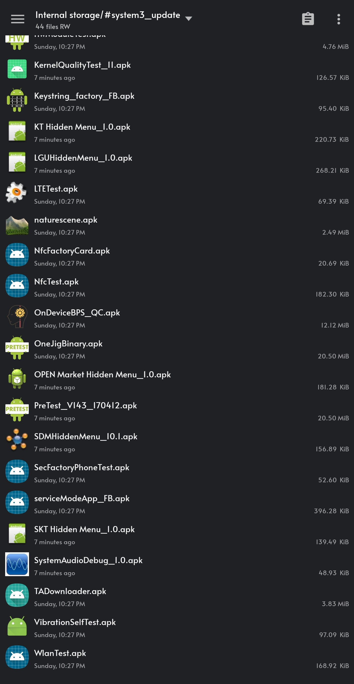

#  system3

#### SYSTEM SHELL FOR A 3RD TIME!

## Key Devices Affected:
  <div align="center">
     
    
    

```
NO MORE SMT! 
NO WORRIES OF AOSP PATCH!
NO DOWNGRADING!
99 PERCENT OF DEVICES, IMMEDIATELY AFFECTED, WATCHES & TABLETS TOO!
```
</div>  


# Introduction:
AASA & ASKSManager:

Back in January & February of 2023, at the height of the rediscovered system shell, Samsung introduced the patch known as the One UI 5.1 SMT patch. 
That patch stopped anymore downgrading of the Samsung-text-to-talk application that was used to gain access to what many know as a system shell. When it was released it ultimately crippled the known exploit at the time. But it wasnt, until a certain unknown individual, made public what is now known as this on [XDA](https://forum.xda-developers.com/t/guide-smt-system-shell-access-on-samsung-oneui-5-1-march-april-update.4583225/)

```
adb install -d -i com.sec.android.preloadinstaller /path/to/SMT.apk
pm install -d -i com.sec.android.preloadinstaller /path/to/SMT.apk
```
When executed, it would allow for SMT to be fully downgraded to again allow access to system uid capabilities whether by using any of the known available apps that worked side by side with SMT,

Apps available at the time
1. [Shizuku 1000 aka ShizukuHack by Z. Wander](https://github.com/zacharee/ShizukuHack/)
2. [K0mraid3s System Shell](https://github.com/k0mraid3/K0mraid3s_System_Shell-Source/)
3. [SMT Shell by BluFeNiX](https://github.com/BLuFeNiX/SMTShell/)
4. [SMT Shell for SamsungWatches](https://github.com/ITDev93/SMTShell-ForSamsungWatches/)
5. [system_shell_2](https://github.com/wr3cckl3ss1/system_shell_2/)

Fast forward to APRIL/MAY 2023, when Samsung decided to not fix their own issues and leave Papa Google to handle it.
Google went ahead and made the appropriate [framework](https://android.googlesource.com/platform/frameworks/base/+/33940a9749666eec991904094ccf56ae4ca4ae10) changes to SHUT everything down as far as downgrades even if the vendor, like Samsung, had hidden overrides, thus ONLY ALLOWING debuggable apps to downgrade past factory images with or without the use of the -d or -i flags.

Many will wonder, what does any of this have to do with system3, well its plain and simple. The argument used for the One UI 5.1 patch,
```
-i com.sec.android.preloadinstaller
```
Belongs to a little file on about 90 to 95 percent of Samsung devices called "ASKSTS.xml" easily located by executing, on your device command line,

```
cat /etc/ASKSTS.xml
```
Opening up the XML, you will be greeted with the following words, "TRUSTEDSTORE"

<div align="center">


</div>


### PrePackageInstaller & FTL (FactoryTestLauncher):

system3 is the "ShellActivity" of FactoryTestLauncher. FTL is what Samsung uses as its main launcher on combination firmware, even including on today's combo firmware.
FactoryTestLauncher holds a system uid of 1000. Just like many system applications. 
Typically when installing, applications like this or any past system applications thru the command line, you're met with the error of:
```
[-3001: INSTALL_FAILED_REJECTED_BY_BUILDTYPE]
```

TO BYPASS THIS
USE THE FOLLOWING COMMAND
```
adb install -i PrePackageInstaller /data/local/tmp/FTL.apk or the name of ANY system package.
pm install -i PrePackageInstaller /data/local/tmp/FTL.apk or the name of ANY system package.
```

Either download FTL to your device and/or PC and push FTL to /data/local/tmp or download any system apps within your device platform signature (there's about 3) and install with ease.

<div align="center">

</div>


## Signature

As I previously stated, theres about 3, maybe more platform signatures that Samsung uses to sign their system packages. The following are two of the more known signatures, Use accordingly!

<div align="center">

  
S22 ULTRA-S23 ULTRA-FOLD 4/5-TAB S7/S8
</div>

<div align="center">

  
LOW TO MID LEVEL DEVICES-NON GALAXY DEVICES
</div>

## Warning
If you don't know what signature your device holds, STOP RIGHT HERE and LEAVE. This is not a exploratory group or resource for ANY user to use. If you're here, it's because you have an idea or know something at least about SMT, system shells, platform signatures or the SAMSUNG LEAK, etc. If you have no clue, please save yourself the headache. 

*STAY OUT OF THE ISSUES TAB, IF YOU ARE HAVING PROBLEMS OR IF SOMETHING IS NOT WORKING. TAKE IT UP WITH SAMSUNG, NOT ME!* Thanks -wr3cckl3ss


## Conclusion #1
### Pt. 1
While, many NOW have FTL installed, thats only half the battle. To open the "ShellActivity" of FTL, the activity to be called from uid 1000 or something HIGHER THAN SHELL. I'll let you use your imagination on how that could be launched. There's a couple ways to do this. Do your research and you will be successful.

When your SUCCESSFUL in launching, you will be met with the following screen,

<div align="center">

</div>


### Pt. 2

THE INSTALL COMMAND IS NOW PATCHED ON ANY FIRMWARE, WITH A SECURITY PATCH OF AUG 1, 2023 OR NEWER. IT IS ALSO PATCHED, EVEN IF ASKSTS.XML IS SHOWING THE 3 PACKAGES.

<div align="center">

</div>


### Secret "FUNC" 

Special Thanks to [SJ Park](https://github.com/seojun0924/)
for the following ....


If you have ever taken a deep look of FTL, you might be wondering why FUNC tab is empty.
This is because it determines what to show based on xml file.
Seeing FTL code carefully, you'll find out that FTL tries to read xml from 3 locations:

/sdcard/factory_ftl_default.xml
/sdcard/factory_ftl_wifi.xml
/system/factory/factory_ftl.xml

We do not have `w` access to /system while we do for /sdcard.
Simply put that xml to /sdcard and you can check now FUNC has something.

You'll be able to find out remaining easily. Now you can open shell if you are SUPER_MODE, I already modified the xml.


# Operation Samsung's Lullaby: WAKE THE DRAGON! Act 2, 3 & 4.
## Act 2: Snakes on a Plane?
I'll just leave this here since its PUBLIC KNOWLEDGE and for those wondering why "PrePackageInstaller" no longer works. 
What is written in stone, doesnt fade away. 

<div align="center">


</div>


## Act 3: Sorry 4 The Wait
As this project has grown and re attention. Its come to my attention of the abuses, this may lead to or what a system shell can get you or what you're able to bypass.
Let me be the first to say, that l,

*DO NOT SUPPORT, OR CONDONE, IN ANY ACTIVITY OR ACTIVITIES THAT INVOLVE THE BYPASS OF ANY SECURITY MECHANISMS, LIKE THOSE OF "KG", "KNOXGUARD", "MDM",
"PAYJOY", "MKOPA".*

And to those, that did take advantage of this. Nothing goes unpunished without consequences. And as of today, many of you know what that consequence is. (RELOCK!?) HAHA!
It's people like those in that community that ultimately ruin and hinder FUTURE exploits or privilege escalation methods from being released. 
And that goes to show, why their hasnt been much movement here on the repo. But there will be some today and more coming soon.

## FTL Update & #system3_powerpack.zips (2.9.24)
As many are aware, the project no longer has the original 'OperationSamsungsLullaby' zips or any of the Non-Galaxy zips. I do not plan on reintroducing those zips back again. If there was something you may 
have wanted or needed, then look around, they cant he too hard to find. Use your brainpower to find your answers. No one is going to do it for you.

<div align="center">
I do however, have, something to introduce today. And those are what I call the "#system3 Power Pack".





*THESE APPS ARE FOR THOSE DEVICES LIKE THE S23 ULTRA, S22 ULTRA, FOLD 4, FOLD5...etc*

*THERE WILL NO LONGER BE ANY UPDATES FOR NON-GALAXY DEVICES*

The power pack will NOT WORK on NEW SECURITY nor will it WORK on Non-Galaxy devices that carry a different signature. However, there are soms tricks, 
that can LEAD YOU all the way up to the One UI 6 Jan. Security patch. At this time i will not disclose what those tricks are and will share including a summary of everything here at a more later date. As I previously stated many times. Make SURE all the apps from the zip folders are installed. REMOVE anything you don't want. but I ultimately did my best to 
inclue any apps in the zips, where i feel, like a possible privilege escalation could be found or where i believe the door was left wide open. It's solely up to you to figure out, HOW?

The combo apps SHOULD and WILL install on vulnerable firmware (July 2023 or older) using the PrePackageInstaller command, I DISCOVERED! Dont believe the hypes, liars, thieves, low-life, scammers who claim something is theres, when NOT a single bit of R&D was ever put into this except by me.

Enjoy the update and please, dont create issues for things you can use your local search provider to find and figure out, including why this project will NOT work for you.

-wr3cckl3ss

## Act 4: Sorry 4 The Wait #2 : Summer 2024.

*UNDER CONSTRUCTION*
  
```
ALL previous commands from the past system shells still work.
Kindly use Google or your preferred search provider to find them.
```
</div>


### Credits
```
Oakieville (https://www.github.com/oakieville/)
Zachary Wander (https://www.github.com/zacharee/) 
BLuFeNiX (https://github.com/BLuFeNiX/)
SJ Park (https://github.com/seojun0924/)
The Elite x Hell's Gate
```

```
Project includes THREE zip folders of a collection of APKs from
factory combination firmware:

#system3-pt_1.zip
#system3-pt_2.zip
#system3-pt_3.zip

New LATEST , FTL signed by Samsung and PPI Vulnerable;
FTL_2.4.03.apk
```
