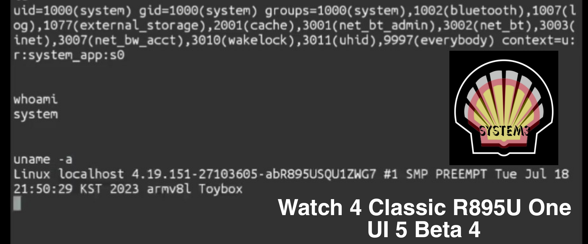
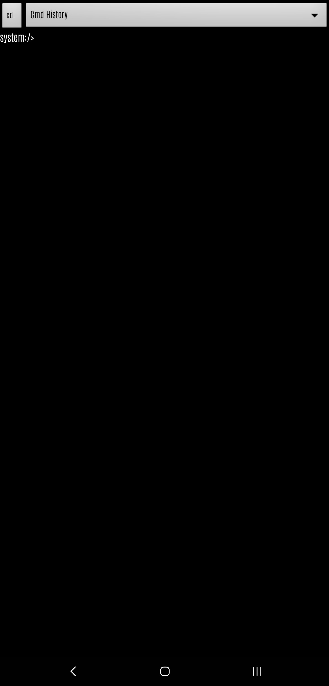
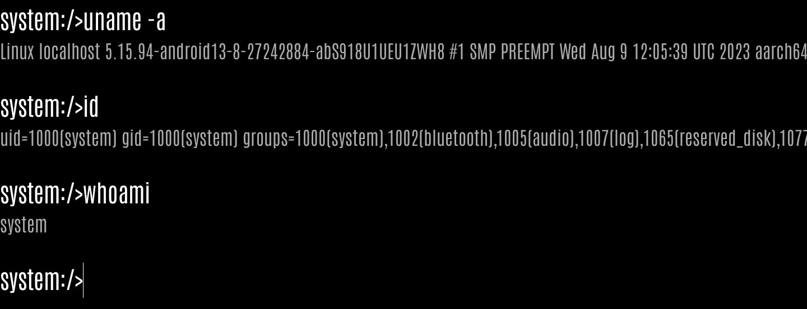

#  system3

### EVERYTHING that a SAMSUNG System Shell with a uid of 1000, can provide!

### AS SEEN ON:
1. [SMT-CVE-2019-16253 by flankerhqd](https://github.com/flankerhqd/vendor-android-cves/tree/master/SMT-CVE-2019-16253/)
2. [K0mraid3s System Shell](https://github.com/k0mraid3/K0mraid3s_System_Shell-Source/)
3. [SMT Shell by BluFeNiX](https://github.com/BLuFeNiX/SMTShell/)
4. [system_shell_2](https://github.com/wr3cckl3ss1/system_shell_2/)

## Key Devices Affected:
  <div align="center">
     
    
    

```
NO MORE SMT! 
NO WORRIES OF AOSP PATCH!
NO DOWNGRADING!
90 TO 95 PERCENT OF DEVICES, IMMEDIATELY AFFECTED, WATCHES & TABLETS TOO!
```
</div>  


# Introduction:
The tale of ASKS, Samsung's "bodyguard" and Package Manager:

Back in January & February of 2023, at the height of the rediscovered system shell, Samsung introduced the patch known as the One UI 5.1 SMT patch. 
That patch stopped anymore downgrading of the Samsung-text-to-talk application that was used to gain access to what many know as a system shell. When it was released it ultimately crippled the known exploit at the time. But it wasnt, until a certain unknown individual, made public what is now known as this on [XDA](https://forum.xda-developers.com/t/guide-smt-system-shell-access-on-samsung-oneui-5-1-march-april-update.4583225/)

```
adb install -d -i com.sec.android.preloadinstaller /path/to/SMT.apk
pm install -d -i com.sec.android.preloadinstaller /path/to/SMT.apk
```
The key to NOW, bypassing the bandaid, Samsung implemented to stop anymore SMT downgrades. When executed precisely, it would guarantee, that SMT would be fully downgraded to once again allow access to system uid capabilities whether by using any of the known available apps that worked side by side with SMT,

Apps available at the time
1. [Shizuku 1000 aka ShizukuHack by Z. Wander](https://github.com/zacharee/ShizukuHack/)
2. [K0mraid3s System Shell](https://github.com/k0mraid3/K0mraid3s_System_Shell-Source/)
3. [SMT Shell by BluFeNiX](https://github.com/BLuFeNiX/SMTShell/)
4. [SMT Shell for SamsungWatches](https://github.com/ITDev93/SMTShell-ForSamsungWatches/)
5. [system_shell_2](https://github.com/wr3cckl3ss1/system_shell_2/)

Fast forward to APRIL/MAY 2023, when Samsung decided to not fix their own issues and leave Papa Google to handle it.
Google went ahead and made the appropriate [framework](https://android.googlesource.com/platform/frameworks/base/+/33940a9749666eec991904094ccf56ae4ca4ae10) changes to SHUT everything down as far as downgrades even if the vendor, like Samsung, had hidden overrides, thus ONLY ALLOWING debuggable apps to downgrade past factory images with or without the use of the -d or -i flags.

Many will wonder, what does any of this have to do with system3, well its plain and simple. The argument used for the One UI 5.1 patch,
```
-i com.sec.android.preloadinstaller
```
Belongs to a little file on about 90 to 95 percent of Samsung devices called "ASKSTS.xml" easily located by executing, on your device command line,
```
ls -lah /etc
```
Opening up the XML, you will be greeted with the following words, "TRUSTEDSTORE"

<div align="center">

</div>
    
*3 TRUSTED PACKAGES*

Which one of them, was used for the first bypass and 2 other unknown packages:

```
com.samsung.android.seinstaller
PrePackageInstaller
```

After AOSP, made the hard [framework](https://android.googlesource.com/platform/frameworks/base/+/33940a9749666eec991904094ccf56ae4ca4ae10) changes it KILLED SMT completely. Now no more downgrades were possible.

## PrePackageInstaller & FTL (FactoryTestLauncher):

After the patch, I decided to start digging and I remembered ASKSTS.xml and the two unknown packages.
If the first bypass, was from here, then I'm sure the next bypass would be here or somewhere close. After many attempts using a combination of arguments, I failed.
Nothing could downgrade SMT. But..... there was one thing, I did find that proved to be what would now be used for system3.

system3 is the "shell activity" of FactoryTestLauncher. FTL is what Samsung uses as its main launcher on combination firmware, even including on today's combo firmware.
FactoryTestLauncher holds a system uid of 1000. Just like many system applications. 
Typically when installing, applications like this or any past system applications thru the command line, you're met with the error of:
```
[-3001: INSTALL_FAILED_REJECTED_BY_BUILDTYPE]
```
The following command, BYPASSES this completely, enabling a hidden and CRITICAL ability to NOW install pretty much any old system application. 
The following will NOT downgrade any apps but who cares when you can work with new abilities.

### *ENTER THE DRAGON*

```
adb install -i PrePackageInstaller /data/local/tmp/FTL.apk or the name of ANY system package.
pm install -i PrePackageInstaller /data/local/tmp/FTL.apk or the name of ANY system package.
```

<div align="center">

</div>

### THE BAD NEWS PT. 1, 2, & 3.

While, many NOW have FTL installed, thats only half the battle. To open the "shell activity" of FTL, the system requires 
for the activity to be called from uid 1000 or anything HIGHER THAN SHELL. I'll let you use your imagination on how that could be launched. I, as an amateur researcher, was able to figure this out and I dont read or write any coding nor I do, have any skills or hold any AOSP secrets that
help me LAUNCH the needed activity. There's a couple ways to do this. Do your research and you too, will be SUCCESSFUL. 

AND FOR THOSE STILL CLUELESS, RE-READ THIS WHOLE PARAGRAPH AND TAKE NOTE OF KEY WORDS, I HAVE USED AND/OR CAPITALIZED. THATS YOUR ONLY HINT!

SOME MAY EVEN DISCOVER A HIDDEN SECRET, IF YOU WERE TO TAP ON THE ICON FOR FTL (MAIN). 

This secret is not for every DEVICE but MANY older devices and some newer ones have this capability. Being that this IS the DEFAULT LAUNCHER on combo firmware, do a quick search and see what comes up when searching. Im thinking of the word, YELLOW. 

When your SUCCESSFUL in launching, you will be met with the following screen,

<div align="center">


<bold>Welcome to system3! Third time's a charm, courtesy of Samsung and the ASKSManager.</bold>
</div>

As of JULY 2023, any firmware that carries the affected ASKSTS.xml is very VULNERABLE. As long as it carries those 3 packages, YOU COULD still use 
PrePackageInstaller as an argument and bypass the error. Now I need to be clear here, as I said in my previous statement. "YOU COULD" means that there are certain exceptions AND there are certain devices where this may not be applicable. Its up to you to figure out what works and what doesn't. 

DO NOT, I REPEAT, DO USE THE ISSUES TAB TO ASK ME ABOUT, WHY SOMETHING DOESN'T WORK OR WHY THE INSTALL COMMAND IS NOT WORKING. I WILL CLOSE OUT ANY ISSUES WITHOUT REASON OR CAUSE. USE YOUR HEAD AND TWO EYES TO READ A LITTLE BIT, IT WONT KILL YOU, I PROMISE.


This SUPER BYPASS, the install command, is NOW PATCHED on any firmware carrying a AUG 1 2023 security patch. 
So this exploit is somewhat considered dead.

Well.....so they thought!

### US S23 ULTRA on the One UI 6 Beta and a Aug 1, 2023 security patch.

<div align="center">


```
Damn Samsung! Why cant you get things right, are we that lazy to allow PATCH REGRESSION or
are the engineers down in Texas, Seoul or Ukraine getting lazy?

Standby until OCT 31st for PART 2 of this story. 
But until then, ENJOY. 
ALL previous commands from the past system shells still work.
Kindly use Google or your preferred search provider to find them.
```
</div>

### Credits
```
Oakieville(https://www.github.com/oakieville/)
For his countless knowledge, patience and testing, thanks bro!

Zachary Wander(https://www.github.com/zacharee/)
For the modified Shizuku, known as Shizuku 1000 and countless knowledge of APKs. This guy is a MASTER in his own class.
 
Samsung
For once again proving that BANDAIDS ARE NOT A FIX, and can easily be ripped off and shredded to pieces.

Project includes an unmodified system APK, com.samsung.android.FactoryTestLauncher, v. 2.2.14 221400000.
```

