#  system3

#### SYSTEM SHELL FOR A 3RD TIME!

## Key Devices Affected:
  <div align="center">
    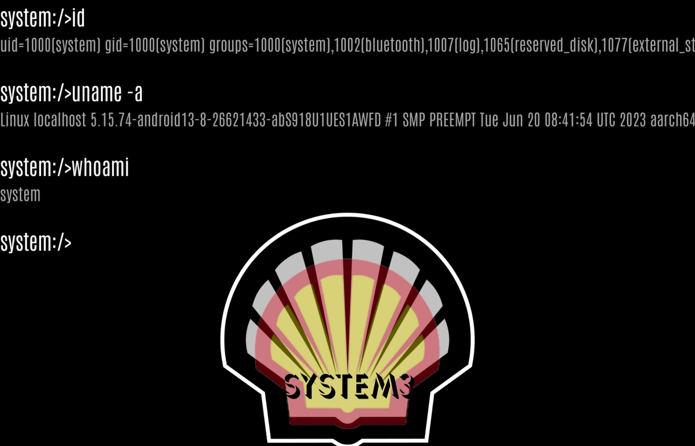 
    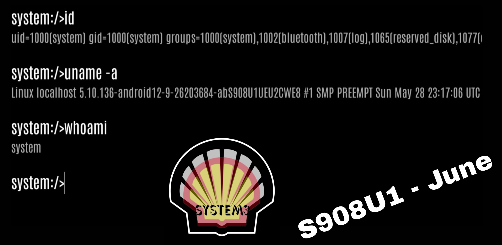
    

```
NO MORE SMT! 
NO WORRIES OF AOSP PATCH!
NO DOWNGRADING!
99 PERCENT OF DEVICES, IMMEDIATELY AFFECTED, WATCHES & TABLETS TOO!
```
</div>  


# Introduction:
AASA & ASKSManager:

Back in January & February of 2023, at the height of the rediscovered system shell, Samsung introduced the patch known as the One UI 5.1 SMT patch. 
That patch stopped anymore downgrading of the Samsung-text-to-talk application that was used to gain access to what many know as a system shell. When it was released it ultimately crippled the known exploit at the time. But it wasnt, until a certain unknown individual, made public what is now known as this on [XDA](https://forum.xda-developers.com/t/guide-smt-system-shell-access-on-samsung-oneui-5-1-march-april-update.4583225/)

```
adb install -d -i com.sec.android.preloadinstaller /path/to/SMT.apk
pm install -d -i com.sec.android.preloadinstaller /path/to/SMT.apk
```
When executed, it would allow for SMT to be fully downgraded to again allow access to system uid capabilities whether by using any of the known available apps that worked side by side with SMT,

Apps available at the time
1. [Shizuku 1000 aka ShizukuHack by Z. Wander](https://github.com/zacharee/ShizukuHack/)
2. [K0mraid3s System Shell](https://github.com/k0mraid3/K0mraid3s_System_Shell-Source/)
3. [SMT Shell by BluFeNiX](https://github.com/BLuFeNiX/SMTShell/)
4. [SMT Shell for SamsungWatches](https://github.com/ITDev93/SMTShell-ForSamsungWatches/)
5. [system_shell_2](https://github.com/wr3cckl3ss1/system_shell_2/)

Fast forward to APRIL/MAY 2023, when Samsung decided to not fix their own issues and leave Papa Google to handle it.
Google went ahead and made the appropriate [framework](https://android.googlesource.com/platform/frameworks/base/+/33940a9749666eec991904094ccf56ae4ca4ae10) changes to SHUT everything down as far as downgrades even if the vendor, like Samsung, had hidden overrides, thus ONLY ALLOWING debuggable apps to downgrade past factory images with or without the use of the -d or -i flags.

Many will wonder, what does any of this have to do with system3, well its plain and simple. The argument used for the One UI 5.1 patch,
```
-i com.sec.android.preloadinstaller
```
Belongs to a little file on about 90 to 95 percent of Samsung devices called "ASKSTS.xml" easily located by executing, on your device command line,

```
cat /etc/ASKSTS.xml
```
Opening up the XML, you will be greeted with the following words, "TRUSTEDSTORE"

<div align="center">
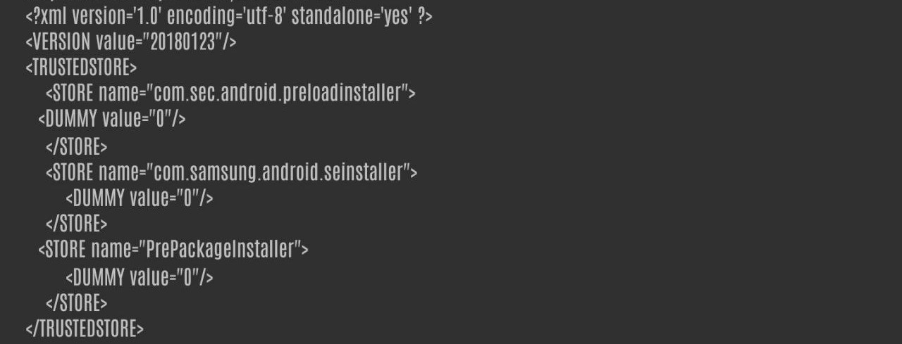

</div>


### PrePackageInstaller & FTL (FactoryTestLauncher):

system3 is the "ShellActivity" of FactoryTestLauncher. FTL is what Samsung uses as its main launcher on combination firmware, even including on today's combo firmware.
FactoryTestLauncher holds a system uid of 1000. Just like many system applications. 
Typically when installing, applications like this or any past system applications thru the command line, you're met with the error of:
```
[-3001: INSTALL_FAILED_REJECTED_BY_BUILDTYPE]
```

TO BYPASS THIS
```
[-3001: INSTALL_FAILED_REJECTED_BY_BUILDTYPE]
```
USE THE FOLLOWING COMMAND
```
adb install -i PrePackageInstaller /data/local/tmp/FTL.apk or the name of ANY system package.
pm install -i PrePackageInstaller /data/local/tmp/FTL.apk or the name of ANY system package.
```

Either download FTL to your device and/or PC and push FTL to /data/local/tmp or download any system apps within your device platform signature (there's about 3) and install with ease.

<div align="center">

</div>


## Signature

As I previously stated, theres about 3, maybe more platform signatures that Samsung uses to sign their system packages. The following are two of the more known signatures, Use accordingly!

<div align="center">
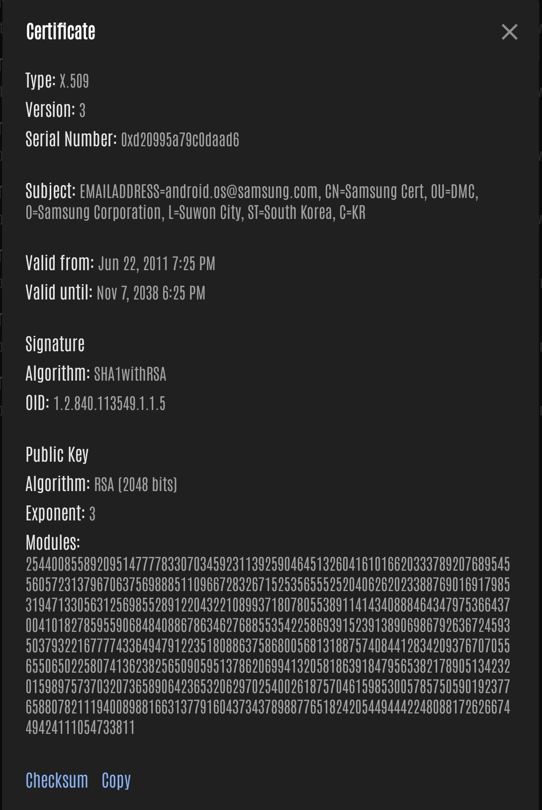
  
S22 ULTRA-S23 ULTRA-FOLD 4/5-TAB S7/S8
</div>

<div align="center">
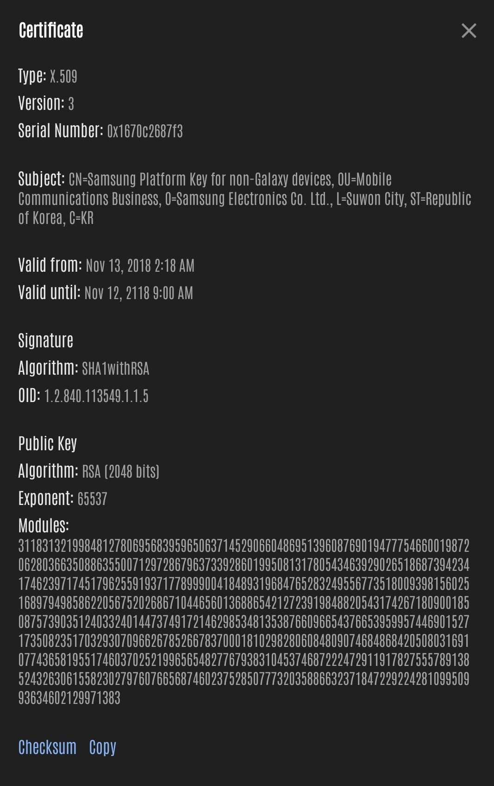
  
LOW TO MID LEVEL DEVICES-NON GALAXY DEVICES
</div>

## Warning
If you don't know what signature your device holds, STOP RIGHT HERE and LEAVE. This is not a exploratory group or resource for ANY user to use. If you're here, it's because you have an idea or know something at least about SMT, system shells, platform signatures or the SAMSUNG LEAK, etc. If you have no clue, please save yourself the headache. 

*STAY OUT OF THE ISSUES TAB, IF YOU ARE HAVING PROBLEMS OR IF SOMETHING IS NOT WORKING. TAKE IT UP WITH SAMSUNG, NOT ME!* Thanks -wr3cckl3ss


## Conclusion

### Pt. 1
While, many NOW have FTL installed, thats only half the battle. To open the "ShellActivity" of FTL, the activity to be called from uid 1000 or something HIGHER THAN SHELL. I'll let you use your imagination on how that could be launched. There's a couple ways to do this. Do your research and you will be successful.

When your SUCCESSFUL in launching, you will be met with the following screen,

<div align="center">

</div>


### Pt. 2

THE INSTALL COMMAND IS NOW PATCHED ON ANY FIRMWARE, WITH A SECURITY PATCH OF AUG 1, 2023 OR NEWER. IT IS ALSO PATCHED, EVEN IF ASKSTS.XML IS SHOWING THE 3 PACKAGES.

<div align="center">
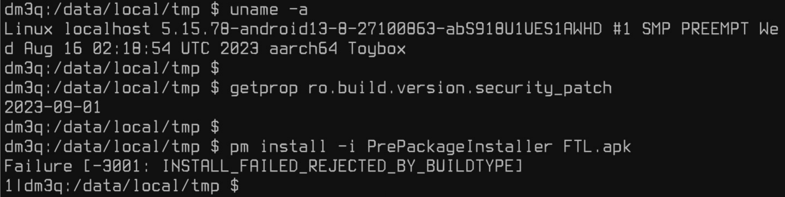
</div>


## Operation Samsung's Lullaby: WAKE THE DRAGON! Act 1

Special Thanks to SJ Park (https://github.com/seojun0924/)
for the following ....
 
The true and only backdoor into having "Combo Firmware" apps without the hassle of any tokens. No fake claims of a MAGISK MODULE. All apps installed strictly due to the PrePackageInstaller command. These apps are pulled from Flip3 combo firmware.
These are the closest applications, you will find before Samsung made the change to start signing their combo firmware with AOSP keys. 
These applications are strictly for devices, like that of the Flip3, S23 Ultra, S22 Ultra, Fold3, etc.


<div align="center">
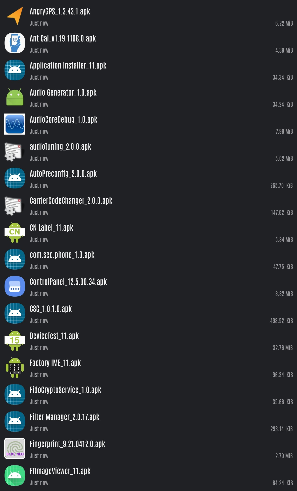
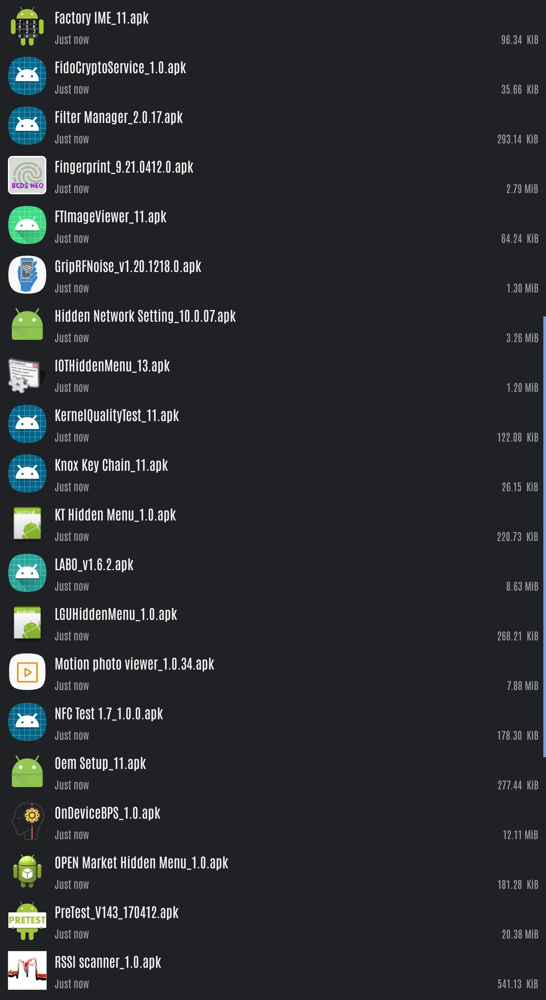
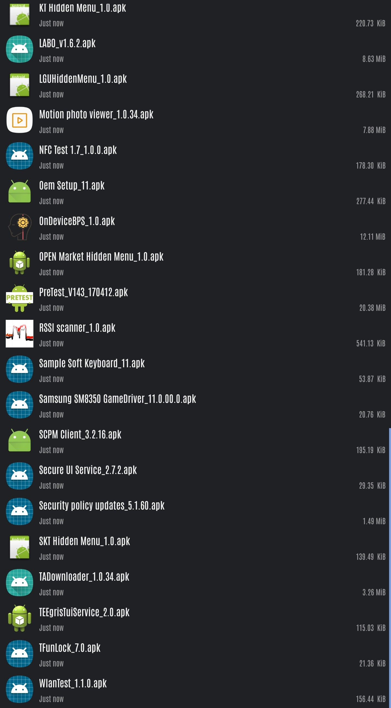

OperationSamsungsLullaby-V1, V2, V3 & V4


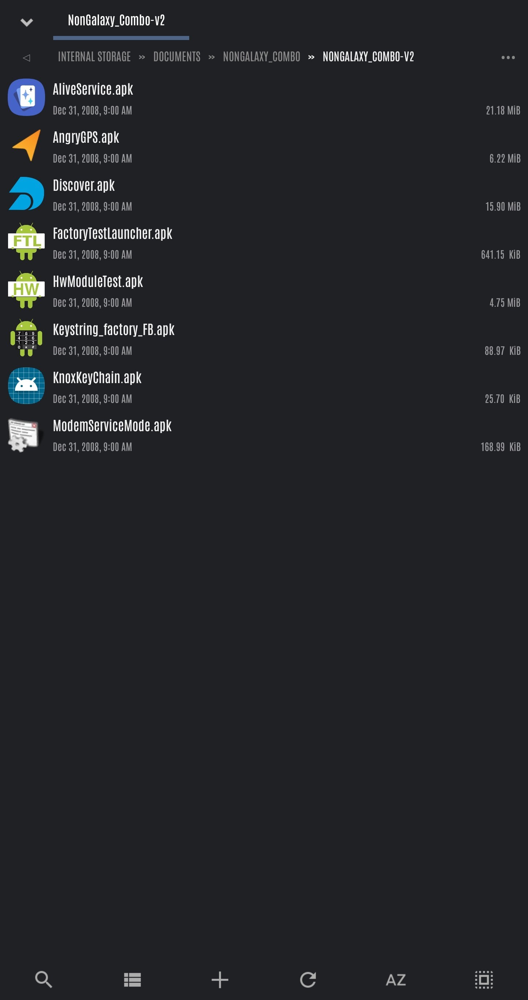
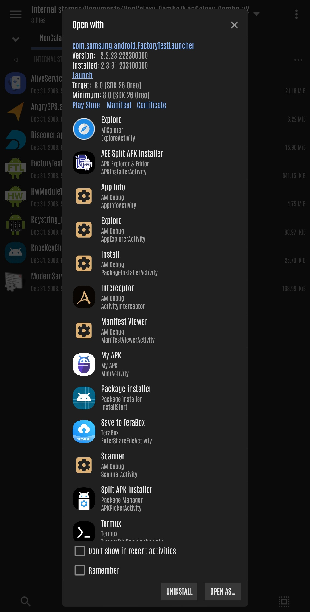
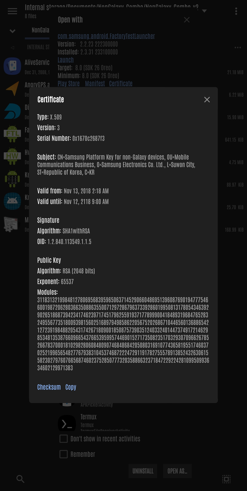


*NOW AVAILABLE as of 9/24*
NonGalaxy_Combo v1, v2, v3 & v4 

</div>


** What you do with the following apps, is your business. Not MINE. IF YOU BREAK SOMETHING, THATS ON YOU AND YOU'RE CARELESSNESS**

## Secret "FUNC" 
If you have ever taken a deep look of FTL, you might be wondering why FUNC tab is empty.
This is because it determines what to show based on xml file.
Seeing FTL code carefully, you'll find out that FTL tries to read xml from 3 locations:

/sdcard/factory_ftl_default.xml
/sdcard/factory_ftl_wifi.xml
/system/factory/factory_ftl.xml

We do not have `w` access to /system while we do for /sdcard.
Simply put that xml to /sdcard and you can check now FUNC has something.

You'll be able to find out remaining easily. Now you can open shell if you are SUPER_MODE, I already modified the xml.

## New Beginning?...One UI 6 Beta 2 & 3, Sept. patch?

<div align="center">

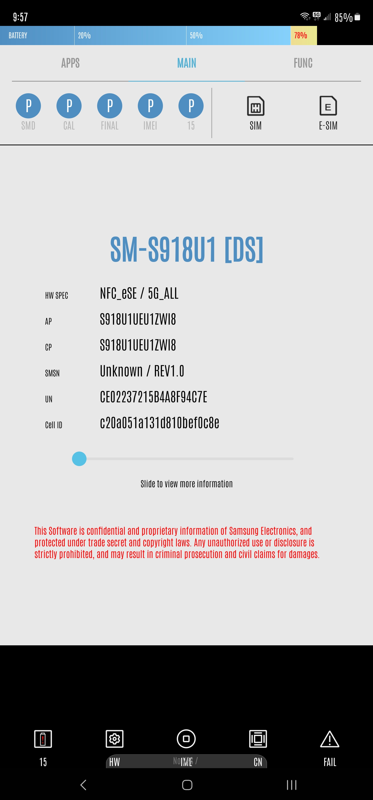  
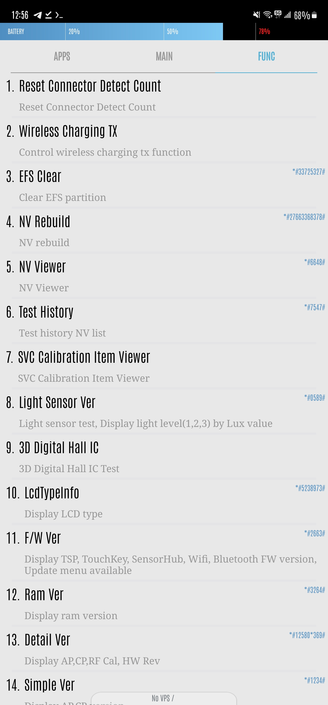
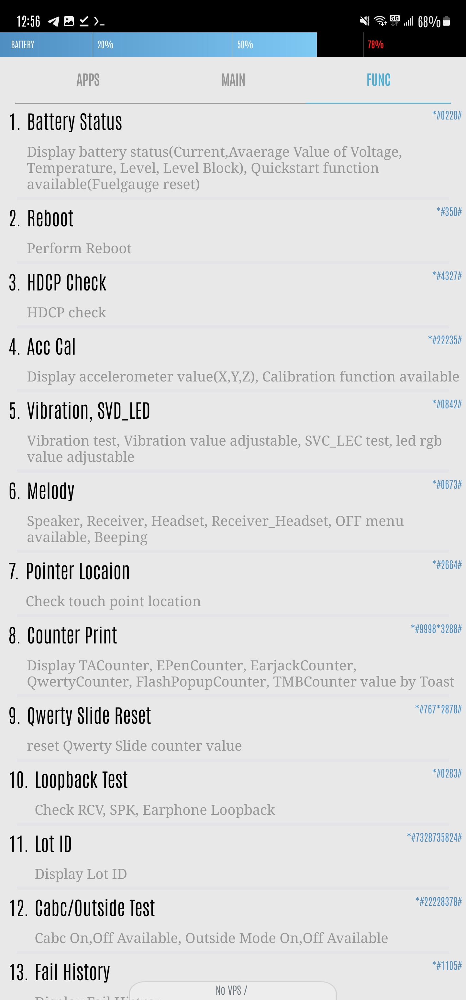
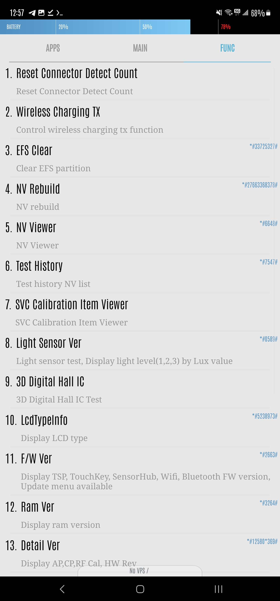
</div>

<div align="center">
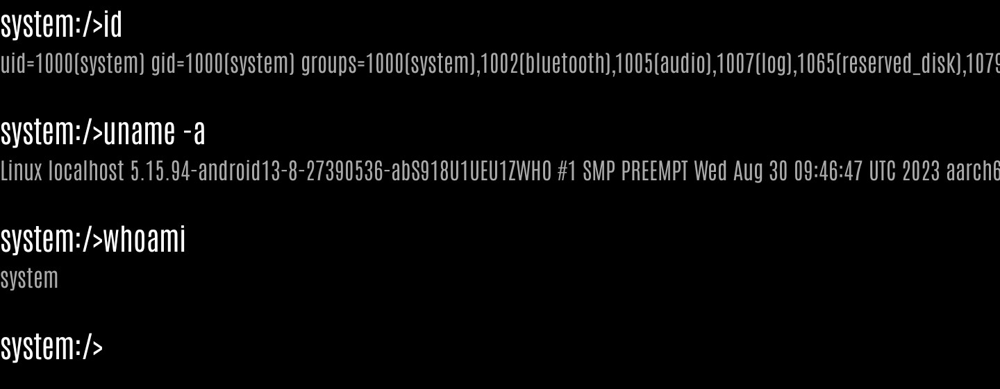
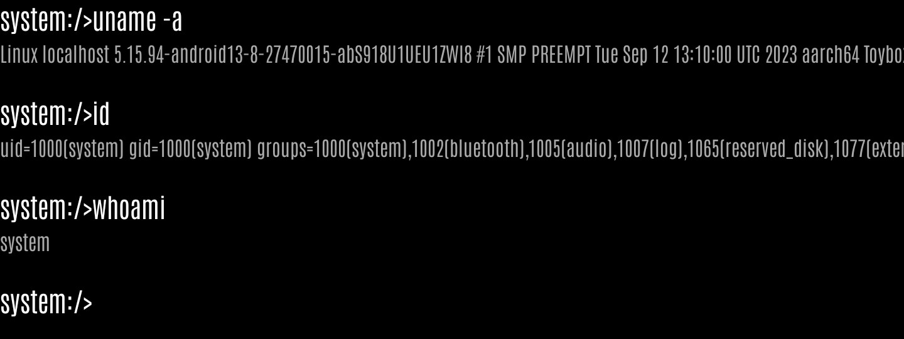

## STILL WORKING...STAY TUNED !!!

  
```
ALL previous commands from the past system shells still work.
Kindly use Google or your preferred search provider to find them.
```
</div>


### Credits
```
Oakieville (https://www.github.com/oakieville/)
Zachary Wander (https://www.github.com/zacharee/) 
BLuFeNiX (https://github.com/BLuFeNiX/)
SJ Park (https://github.com/seojun0924/)
The Elite
South Harmon Institute of Technology
Samsung Electronics
Donald J Trump...jk jk lmao
```

```
Project includes three unmodified system APKs from
factory combination firmware:

OperationSamsungsLullaby-V1.zip
OperationSamsungsLullaby-v2.zip
OperationSamsungsLullaby-v3.zip
OperationSamsungsLullaby-v4.zip
Collection of unmodified combo apps pulled from Flip3 combo firmware.

com.samsung.android.FactoryTestLauncher_v.2.3.31.apk
Used for Galaxy Devices (S21, S22, S23, Flip5, Fold4, Tab)

com.samsung.android.FactoryTestLauncher_v.2.2.23.apk
Used for low to mid budget devices and non-Galaxy devices.

com.samsung.android.GEDFactoryTestLauncher.apk
Used on Watches. (Watch4, Watch5)
```
